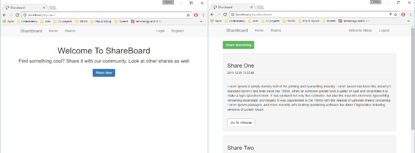
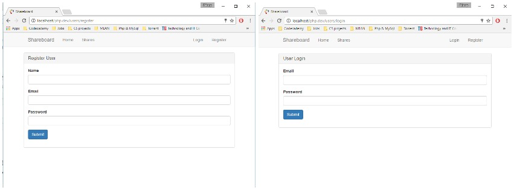

This is a repository for my project:

# Share-Board-Application-with-custom-MVC-using-PHP-and-MySql.

Share Board Application is a Web Project,in which we built a custom MVC framework with complete Login and Registration system,that allows users to Register,Login and create "Shares" or delete,which are like blog/Fb posts and link them to some other resources such as an article related to posts.We created a mutiple classes and integrated into the application with php md5() password encryption algorithm.Technologies used are HTML5,CSS,JS,Bootstrap,PHP & MySql as Database.

## Instructions

- Install any of the PHP,MySql,Apache stack software on your PC,MAC or Linux.(Ex: WAMP,XAMP,AMPSS,LAMP etc).
- Then extract the zip and upload it in the software(Ex: WAMP,XAMP,AMPSS,LAMP etc).
- Then copy the data base files into your MySql database using PhpMyAdmin or create new tables according to the project.
- Then setup a domain with in the apache server which reads index.php in the extracted zip folder
- To run the application,go to the URL(php.dev which i have used) of your domain in the browser.

## More Stuff

For more projects and coding stuff, follow me @[Dileep Kumar](https://github.com/dileepkumar9030) 
